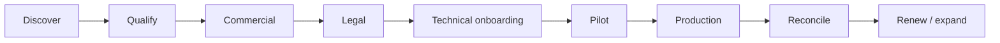

# Partner lifecycle workflow (complete)

Every phase of a Leta **fulfillment partner** relationship — from first conversation through renewal. Designed for a **two-person** operator team: heavy lifting outsourced to Stripe, Checkr, Firebase, Cal.com; Leta owns **orchestration + Georgia bench**.

---

## Phase map

---

## 1. Discover & positioning

**Who:** MSPs, OEMs (Qmatic-class), national FSNs (Barrister-class), enterprise IT with Georgia sites.

**Message:** You keep the customer; we add **bench + visibility + modern comms** — not channel conflict ([`../05-marketing-and-sales/partner-channel-win-win.md`](../05-marketing-and-sales/partner-channel-win-win.md)).

**Entry points:** `partners@leta.repair`, contact form `intent=partner`, intro calls (Cal.com), referrals from tech network.

**Output:** Qualified lead record (spreadsheet or HubSpot free tier later).

---

## 2. Qualify (fit checklist)

| Question | Pass criteria |
|----------|----------------|
| Georgia volume? | Recurring onsite need in GA (not one-off) |
| GUS pattern? | They sub contract or hold SLA for others |
| Ticket discipline? | Can pass **partner ticket #**, scope, POC rules |
| Insurance? | GL + WC or willing to meet Leta addendum |
| Billing maturity? | Net-30 acceptable; can pay Leta on executed WOs |
| Anti-poaching? | Accepts techs stay on-platform for partner-originated jobs |

**Disqualify:** Wants off-platform cash to techs; refuses close-out artifacts; no POC on enterprise tickets.

---

## 3. Commercial

| Item | Owner | Tool |
|------|-------|------|
| Rate card | Leta | Spreadsheet → portal rate tables (v2) |
| SLA tiers | Partner + Leta | P1–P4 response/resolution windows |
| Mobilization | Leta policy | Paid drive time rules in MSA |
| Pilot scope | Joint | 5–10 WOs, one region — [`pilot-playbook.md`](./pilot-playbook.md) |
| Invoicing cadence | Leta | Weekly CSV + monthly invoice |

**Rate types (mirror industry):** flat break/fix, hourly caps, minimums, after-hours multiplier, **locked at tech accept** (Barrister pain point).

---

## 4. Legal & risk (counsel before signature)

| Document | Purpose |
|----------|---------|
| Partner channel agreement | MSA, SLA, indemnity, IP on artifacts |
| DPA | If partner sends end-customer PII |
| Insurance certificate exchange | GL limits, additional insured |
| 1099 flow | Leta is payer of record to techs; partner pays Leta |

Outline: [`../04-legal-and-compliance/partner-channel-agreement-outline.md`](../04-legal-and-compliance/partner-channel-agreement-outline.md).

**Never store on Leta servers:** SSN, full bank details — **Stripe Connect** + **Checkr** only.

---

## 5. Technical onboarding

| Step | Action | Tool |
|------|--------|------|
| 5.1 | Create `tenantId` + `partnerId` | Firestore / admin script |
| 5.2 | Invite dispatcher users | Firebase Auth + `partner_dispatcher` claim |
| 5.3 | Configure notification emails | `partners@` routing |
| 5.4 | PSA link (optional v1) | Manual ticket # field; API phase 2 |
| 5.5 | Sandbox ticket | Test map, timeline, Leta Live |
| 5.6 | Runbook walkthrough | 30 min screen share |

Checklist: [`onboarding-checklist.md`](./onboarding-checklist.md).

---

## 6. Pilot (prove the model)

See [`pilot-playbook.md`](./pilot-playbook.md). Success = **5+ WOs** with:

- Partner did not need status phone calls
- ≥1 overwatch session on hard ticket (optional)
- Close-out package accepted for billing
- Tech payout within 24–48h

---

## 7. Production operations

### 7.1 Ticket intake (partner → Leta)

| Method | v1 | v2 |
|--------|----|----|
| **Partner portal form** | Primary | + templates |
| **Email to ops** | Manual entry | Parse rules |
| **API / PSA webhook** | — | ConnectWise, ServiceNow, Autotask |
| **Phone** | Escalation only | Logged to ticket notes |

**Required fields:** site address, schedule window, skill tags, scope, **partner WO #**, POC name/phone, access rules (`do_not_call_site` flag), rate type, attachments.

### 7.2 Dispatch (Leta → tech)

| Step | Barrister legacy | Leta |
|------|------------------|------|
| Match | Phone tree | Algorithm: distance, skills, rating |
| Offer | Call tech | Push notification + in-app offer |
| Accept | Verbal + email | Tap accept; **rate frozen** |
| Confirm en route | Call dispatch | Status `en_route` + optional auto-SMS to partner |
| Pre-arrival | Call before leaving | App prompt: confirm WO still open |

Details: [`ticket-lifecycle-gus.md`](./ticket-lifecycle-gus.md).

### 7.3 On-site execution

- Find POC by name (reduce floor disruption).
- **Leta Live** for remote tier (replaces mass Teams bridge).
- Access PIN: tap-to-reveal, GPS-gated when enabled.
- Photos + digital sign-off mandatory.

### 7.4 Partner visibility (no-call guarantee)

Dashboard: map, timeline, documents — partner never needs to call Leta to ask “where is the tech?”

### 7.5 Close-out & QA

States: `completed` → partner review window → `approved_for_billing` → Stripe payout to tech.

Disputes: [`reconciliation-and-billing.md`](./reconciliation-and-billing.md).

---

## 8. Incentives — keep partner + tech on Leta

| Stakeholder | Risk | Leta lever |
|-------------|------|------------|
| **Partner** | Tech contacted off-platform | Contract + faster SLA proof only via portal artifacts |
| **Partner** | Leta bypassed next job | Rate card only honored on-platform; API idempotency |
| **Tech** | Partner calls tech direct | Offers only through app; partner WO # in app |
| **Tech** | Slow pay | Stripe Connect 24h target |
| **Leta** | Partner uses us as last resort | Pilot KPIs on visibility + first-time fix |

---

## 9. Reconciliation & renewal

Weekly: CSV of completed WOs → partner AP.

Monthly: QBR — SLA %, cancel rate, overwatch usage, Georgia coverage gaps.

Renewal: expand counties, add PSA integration, dedicated talent pool (premium).

---

## 10. Communication rails (summary)

Full detail: [`communication-rails.md`](./communication-rails.md).

| Event | Channel |
|-------|---------|
| New WO to tech | Push + SMS optional |
| Tech en route / onsite | Partner portal timeline (not phone) |
| Escalate remote | Leta Live + portal alert |
| Partner question | Tawk / email / text ops line |
| Billing dispute | Email + ticket audit log |

---

## 11. Third-party boundaries

See [`third-party-stack.md`](./third-party-stack.md).

---

## Anecdote → feature traceability

| Real-world story | Leta feature |
|------------------|--------------|
| Food Lion, Cradlepoint, roof/ladder | Skill tags, scope flags, safety checklist |
| Don’t call customer | `contact_policy: poc_only` |
| Call before arrive — WO canceled | Pre-arrival confirm step |
| 50-person Teams bridge | **Leta Live** 1:1 session per ticket |
| Rack lock PIN from remote | Access UI + timed reveal |
| Qmatic → Barrister → tech | **GUS** partner ref + remote join |
| Spectrum SLA pressure | Partner timeline + pilot SLA report |

---

## Related

- Screen list: [`../02-app-documentation/partner-portal/screen-inventory.md`](../02-app-documentation/partner-portal/screen-inventory.md)
- Engineering backlog: [`CONTINUE.md`](./CONTINUE.md)
